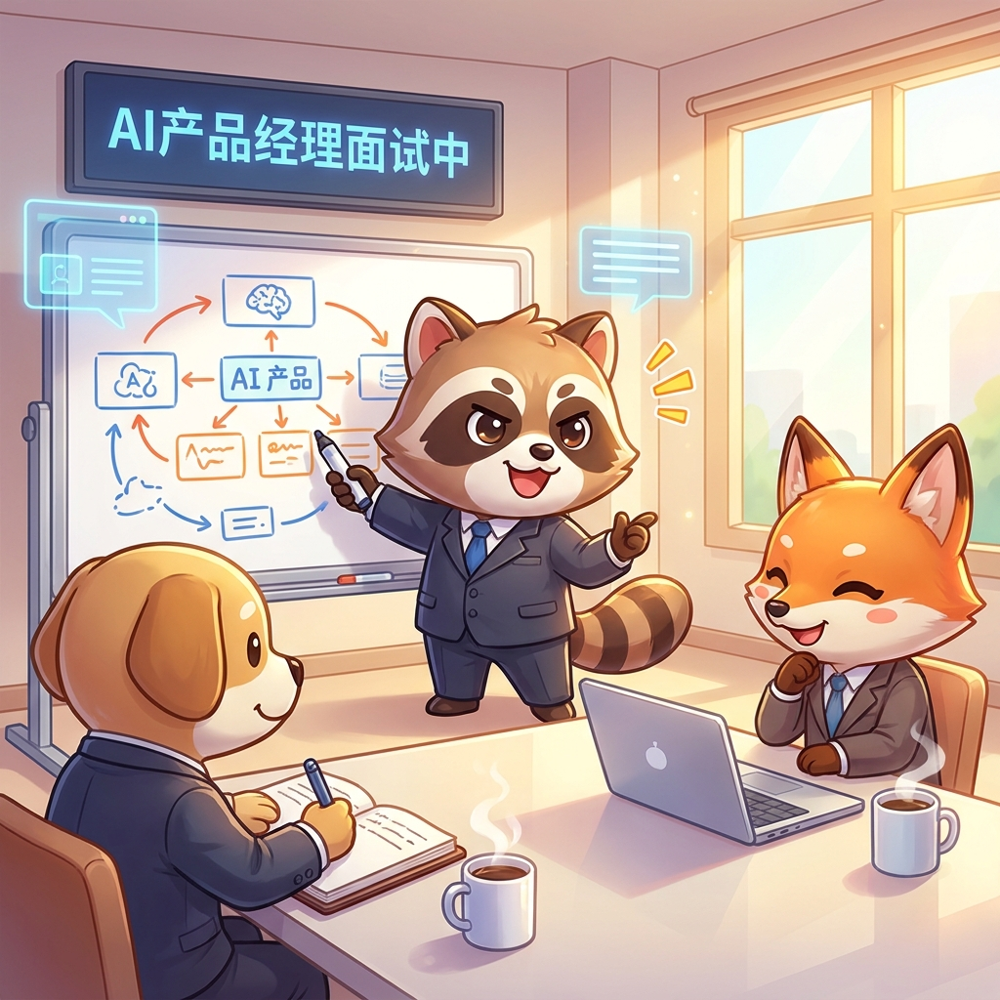

# 2026，AI产品经理求职指南

> 2026年6月，AI产品经理这个岗位正在经历一场结构性重塑。需求爆发与门槛升级同时发生，薪资溢价与竞争加剧并行。这不是一篇泛泛的"求职建议"，而是基于最新数据的市场地图——帮助你在这个窗口期做出精准决策。

---

## 目录

1. [市场全景：需求爆发的真相](#一市场全景需求爆发的真相)
2. [薪资地图：中美市场对比](#二薪资地图中美市场对比)
3. [能力模型：2026年什么才是硬通货](#三能力模型2026年什么才是硬通货)
4. [岗位谱系：找到你的切入点](#四岗位谱系找到你的切入点)
5. [面试准备：高频题型与答题框架](#五面试准备高频题型与答题框架)
6. [求职策略：不同背景的转型路径](#六求职策略不同背景的转型路径)
7. [避坑指南：常见的错误认知](#七避坑指南常见的错误认知)
8. [行动清单：从今天开始](#八行动清单从今天开始)

---

## 一、市场全景：需求爆发的真相

### 1.1 数据快照（2026年1-5月）

| 指标 | 数据 | 来源 |
|------|------|------|
| AI领域岗位量同比增长 | **8.7倍** | 脉脉2026年春招报告 |
| AI产品经理增速 | **129%**（三位数增长持续近一年） | 脉脉 |
| AI智能体相关职位增速 | **455%** | 脉脉 |
| AI领域占新经济岗位比重 | 从2.78%升至**22.03%** | 脉脉 |
| AI产品经理人才供需比 | **5.1:1**（供不应求） | 脉脉 |
| AI产品经理在热招岗位排名 | **第5位**，招聘指数170 | 脉脉 |

### 1.2 关键判断

脉脉创始人林凡的原话："**2026年是Agent大年，AI应用人才将迎来招聘需求爆发。**"

但这段话需要拆开看：

- **好消息**：岗位总量确实在暴增。AI应用层（区别于模型层和基础设施层）的产品岗是增量最大的方向。
- **坏消息**：AI领域人才供需比已从1.02升至1.23——涌入的人比岗位增长更快，门槛在提高。
- **关键分化**：初级岗位（应届生可投）持续缩减；高级岗位（3年+AI落地经验）缺口巨大。

### 1.3 谁在招人

**断层第一：字节跳动。** AI产品岗位占其全部产品岗的30%以上，豆包生态是核心方向。

**第二梯队**：大疆（首次超越小红书跃居第二）、小红书、腾讯、美团、蚂蚁集团。

**新势力**：具身智能企业异军突起——自变量机器人增长832%，智元创新增长209%。

**跨界抢人**：电力、金融、电商等传统行业同步加入AI人才争夺战，招聘已非纯互联网公司专利。

---

## 二、薪资地图：中美市场对比

### 2.1 中国市场

| 岗位类型 | 月薪范围（RMB） | 备注 |
|----------|----------------|------|
| 不强制AI能力的PM | 15K–40K | 传统PM薪资区间 |
| 要求AI能力的PM | 25K–50K | 能力溢价约30-40% |
| 大模型产品经理 | 40K–75K | 字节/小红书/腾讯等 |
| AI科学家/负责人 | **132,796元（平均）** | 唯一突破10万的岗位 |
| AI领域新发岗位平均 | **62,850元** | 全行业对比基数 |

**典型案例**：
- 豆包AI产品经理：年薪约60万
- 千问App用户增长算法工程师：年薪最高128万
- 小红书AI产品经理：2025年均薪53,416元/月，同比增长38.7%

### 2.2 美国市场

| 级别 | 年薪范围（USD） | 代表公司/岗位 |
|------|----------------|--------------|
| 初级AI PM | $90K–$130K | 中小型科技公司 |
| 中级AI PM | $130K–$180K | 中大型企业 |
| 高级AI PM | $150K–$250K | 科技大厂/AI创业公司 |
| Staff/Principal | $200K–$350K | 头部科技公司 |
| AI Lab级PM | **$305K–$460K** | Anthropic Claude Code PM |

> Anthropic为Claude Code产品经理开出的$305K–$460K，标志着顶级AI实验室对产品岗的估值已超越传统大厂同级别岗位。

### 2.3 薪资趋势判断

1. **能力溢价显著**：具备AI落地能力的PM比同级别传统PM薪资高30-50%。
2. **薪资增速分化**：AI相关岗位薪资持续攀升，非AI产品岗滞涨甚至收缩。
3. **地域差距在缩小**：新加坡Google GenAI PM岗年薪S$192K–S$384K，已接近美国水平；国内头部大厂AI PM薪资与国际差距快速收窄。

---

## 三、能力模型：2026年什么才是硬通货

### 3.1 金字塔模型

```
                    ┌─────────────┐
                    │  商业判断力   │  ← "该不该用AI，值不值得做"
                    ├─────────────┤
                    │  产品方法论   │  ← 需求洞察、实验验证、数据驱动
                    ├─────────────┤
                    │  AI技术素养   │  ← 模型认知、Agent设计、评估体系
                    └─────────────┘
```


底座是技术素养，但你不需要成为算法工程师。85%以上的AI产品岗不要求编码，但要求你能和工程师在同一层次对话。

### 3.2 五大核心能力

#### ① 模型认知与边界管理

- 知道LLM擅长什么（生成、总结、推理）和不擅长什么（精确计算、确定性逻辑）
- 理解上下文窗口限制，能设计合理的记忆管理策略
- 能估算Token成本，在效果和成本之间做权衡
- 理解Temperature、Top-P等参数对输出行为的影响

#### ② Prompt工程与结构化表达

- 能设计包含角色设定、任务拆解、约束条件、Few-Shot示例、输出Schema的复杂Prompt模板
- 能运用思维链（CoT）引导模型分步解决复杂问题
- 能根据用户画像和历史行为设计动态Prompt策略

#### ③ Agent与工作流编排

- 能将模糊用户目标拆解为多个子任务，分配给不同工具或子Agent
- 能设计带分支、重试、降级的多步执行流
- 能在关键决策点设计人工介入机制（Human-in-the-Loop）
- 熟悉主流Agent框架：Coze、Dify、LangChain、LangGraph

#### ④ 数据工程与RAG设计

- 理解RAG全流程：切片→向量化→检索→重排序
- 能设计知识库架构和更新策略
- 理解数据飞轮：用户反馈→数据标注→模型迭代

#### ⑤ 评估与监控体系

- 能搭建自动化评估集（Golden Dataset）
- 从准确性、相关性、安全性、延迟、成本五个维度监控
- 能通过Bad Case反推问题根因（Prompt问题？知识库缺失？模型能力不足？）

### 3.3 技术知识清单（面试必考）

| 知识点 | 需要理解到什么程度 |
|--------|-------------------|
| **Transformer架构** | 理解注意力机制的基本原理，不需要手写代码 |
| **Prompt工程** | 能手写复杂Prompt，掌握Few-Shot、CoT、RISEN等框架 |
| **RAG** | 理解为什么它是企业级AI应用的基石，能画架构图 |
| **模型微调（Fine-tuning）** | 理解与Prompt/RAG的取舍逻辑：成本递增，Prompt < RAG < 微调 |
| **Agent设计** | 理解规划、工具调用、状态管理、人机回环 |
| **Token经济学** | 能算成本，能设计缓存策略 |
| **模型幻觉** | 能提出产品层面的多层防御方案 |
| **多模态** | 理解文字+图像+语音的融合场景 |
| **模型评估** | 理解LLM-as-Judge、人工评测、自动评测的适用场景 |

---

## 四、岗位谱系：找到你的切入点

### 4.1 三类AI PM

| 类型 | 占比 | 工作内容 | 门槛 |
|------|------|---------|------|
| **应用层PM** | ~60% | 在现有产品中集成AI功能（聊天、总结、推荐等） | 最低，传统PM最容易切入 |
| **平台层PM** | ~30% | 为开发者构建AI工具和基础设施（编排平台、评估框架等） | 中等，需要技术产品经验 |
| **基础设施层PM** | ~10% | 向量数据库、GPU编排、模型部署等底层系统 | 最高，需要深度技术背景 |

**建议**：80%的转型者应瞄准应用层PM。

### 4.2 新兴细分：Agent PM

Apple在2026年公开招募的"Agentic AI Product Manager"JD明确要求：
- 8年以上技术或产品经验
- 能端到端构建Agent产品（从数据管道到UI）
- 具备多Agent系统或复杂LLM编排经验者优先

这代表了行业对Agent PM的期望基线——不再是"懂AI的产品经理"，而是"能设计智能系统的产品架构师"。

### 4.3 行业选择建议

| 行业 | AI应用成熟度 | 竞争度 | 建议 |
|------|------------|--------|------|
| 互联网/AI原生 | 最高 | 最激烈 | 有相关经验可冲，新手谨慎 |
| 金融科技 | 高 | 中 | 金融+AI复合背景稀缺，溢价高 |
| 医疗健康 | 中 | 低 | 壁垒高，医疗背景转型优势大 |
| 智能制造/具身智能 | 爆发期 | 低 | 蓝海，岗位增速800%+ |
| 电商/零售 | 高 | 中 | 应用场景丰富，适合入门 |
| 教育 | 中 | 低 | 政策敏感，关注合规能力 |
| 电力/能源 | 起步期 | 极低 | 跨界抢人，传统行业经验是优势 |

---

## 五、面试准备：高频题型与答题框架



### 5.1 2026年面试变化

传统产品题（"如何设计一个电梯"）权重下降。新的主流题型围绕三个方向展开：**AI功能落地、数据决策、技术边界判断。**

### 5.2 四大必考题型

#### 题型一：AI功能落地设计

> "如何在传统产品中融入AI能力？" / "如何在CRM中引入AI智能推荐？"

**答题框架：场景—能力—验证**

1. **场景定位**：先找真痛点——重复机械工作、高门槛专业经验的活
2. **技术选型**：Prompt → RAG → 微调，按成本和复杂度递进
3. **验证方案**：A/B测试设计 + 降级方案（AI挂了怎么办）

面试官在看的：你能不能判断"该不该用AI"，而不是"怎么用AI"。

#### 题型二：数据诊断与决策

> "核心指标下降了15%，你会如何排查？"

**答题框架**：

1. 确认数据准确性（统计口径、采集异常）
2. 多维度拆解（时间、用户群、渠道逐层下钻）
3. 形成假设 → 设计验证实验
4. 短期止血 + 长期治本

#### 题型三：技术可行性评估

> "如何评估一个AI功能的技术可行性与投入产出比？"

**考察点**：AI能力边界的理解、Token成本估算、分阶段投入规划。

#### 题型四：AI产品体验评估

> "用过哪些AI产品？如何评估AI生成内容的质量？"

**准备要点**：提前深度使用ChatGPT、Claude、Cursor、Kimi、豆包等产品，能从产品视角分析优劣——不只是"好不好用"，而是为什么好、哪里可以更好。

### 5.3 大厂AI面试深度题

- "Multi-Agent和单Agent的取舍逻辑是什么？"
- "Function Calling失败率容忍度怎么设？降级方案怎么设计？"
- "上线后你分哪几个阶段关注哪些指标？"
- "评测体系怎么搭？机评和人评怎么分工？"
- "数据飞轮怎么设计？如何让用户反馈持续驱动模型迭代？"

### 5.4 行为面试高频题

| 问题 | 考察点 |
|------|--------|
| "大模型和上一代AI最本质的区别是什么？" | 对技术范式的理解深度 |
| "AI幻觉在产品层面如何缓解？" | 防御层设计思维 |
| "资源有限时，优先在哪引入大模型？" | 优先级判断和ROI意识 |
| "未来三年AI PM最不可替代的能力是什么？" | 职业认知和长期思考 |

### 5.5 面试准备实操

1. **完成至少3个AI项目模拟**：从问题定义→数据获取→技术选型→效果评估，完整走一遍
2. **深度体验5+款AI产品**：能说出每款产品的设计亮点、核心缺陷和你的改进方案
3. **用STAR-R法则整理经历**：Situation → Task → Action → Result → **Reflection**（反思是关键加分项）
4. **准备3个真实AI案例**：涵盖Prompt优化、RAG搭建、Agent设计等不同技术栈
5. **简历关键词密度**：确保"Prompt工程""RAG""Agent设计""模型评估"等术语自然出现

---

## 六、求职策略：不同背景的转型路径


### 6.1 四条典型路径

#### 路径一：传统产品经理 → AI产品经理

**优势**：产品方法论扎实，需求洞察和商业判断是现成的。

**补齐项**：
- AI技术素养（推荐学习周期：6-8周集中投入）
- 从工具使用开始：先熟练使用AI产品，再理解背后原理
- 优先瞄准**应用层PM**（60%市场，最容易切）

**信号**：简历中出现"主导了XX产品的AI功能模块设计，上线后指标提升XX%"，比证书或课程有效得多。

#### 路径二：数据分析师/数据科学家 → AI产品经理

**优势**：天然理解模型、数据和评估，技术对话无障碍。

**补齐项**：
- 产品方法论：需求洞察、用户研究、商业思维
- 从"模型最好"转向"最合适的解决方案"——最大的思维转变

**信号**：能讲清楚"为什么选这个模型而不是那个，为什么这个场景不适合用AI"。

#### 路径三：软件工程师 → AI产品经理

**优势**：深刻理解技术可行性边界，工程落地思维强。

**补齐项**：
- 用户同理心和商业判断——从"能实现吗"转向"值得做吗"
- 沟通和跨部门协调——从执行者到引导者

#### 路径四：应届生/转行新人

**挑战最大**：初级岗位持续缩减，人工智能专业毕业生也面临"无经验可投"的困境。

**破局策略**：
- **用作品集替代经验**：基于AI完成2-3个有实际用户的项目Demo
- **从传统PM切入再转AI**：先拿产品岗入场券，内部争取AI项目
- **瞄准跨界行业**：医疗+AI、法律+AI等有领域壁垒的方向，竞争远小于纯互联网

### 6.2 渠道策略

| 渠道 | 效率 | 适用场景 |
|------|------|---------|
| 脉脉/猎聘 | 高 | 国内大厂岗位最多，主动触达HR |
| LinkedIn | 高 | 外企/出海企业 |
| 内推 | 最高 | 成功率是海投的5-10倍 |
| 行业会议/Meetup | 中 | 建立行业认知和弱联系 |
| GitHub/即刻/X | 中 | AI圈信息密度最高，提前积累行业感 |

---

## 七、避坑指南：常见的错误认知

### 误区一："必须学会写代码/考证书才能转AI PM"

**真相**：85%以上AI产品岗不要求编码。面试官在乎的是你能否理解AI的能力边界和做对的技术选型，不是你能不能写Python。

与其花三个月学算法，不如花三周深度使用AI产品、搭建一个Agent Demo。

### 误区二："AI产品经理就是写Prompt的"

**真相**：Prompt工程是基本面，但远不是全部。AI PM的核心价值是**在不确定性中定义价值并驾驭价值**——判断哪里该用AI、用哪种方案、怎样衡量效果、如何持续迭代。

### 误区三："大厂AI PM岗位最多，只投大厂就对了"

**真相**：字节的确断层领先，但竞争也最激烈。跨界行业（金融、电力、医疗）的AI PM岗薪资不低、竞争小得多、且入行后转大厂更轻松。

### 误区四："多学几个AI工具就够了"

**真相**：2025年这或许成立，但2026年市场正在去泡沫化。仅会堆砌技术名词的"伪AI产品经理"正在被快速淘汰。企业要的是**能创造可量化业务价值的AI PM**，不是懂AI名词的PM。

### 误区五："Agent PM和普通AI PM没什么区别"

**真相**：Agent PM需要完全不同的产品思维——你不是在管理一个静态功能，而是在培育一个会进化、有行为模式的数字系统。多Agent协作、人机回环、可靠性工程（99%→99.9%→99.99%）是全新的挑战。

---

## 八、行动清单：从今天开始

### 如果你正在找工作

```
□ 本周内：深度体验5款主流AI产品，写下每款的产品分析笔记
□ 两周内：用Coze/Dify搭建一个可运行的Agent Demo
□ 三周内：完成一个端到端的AI功能模拟项目（问题定义→Prompt设计→评估→迭代）
□ 一个月内：整理3个AI相关项目案例，用STAR-R法则写成面试故事
□ 持续：在即刻/X/GitHub上关注AI产品圈动态，积累行业语感
```

### 如果你有一份工作但想转型

```
□ 在公司内部找一个可以用AI提效的真实场景，主动做
□ 申请参与或旁听公司AI项目的评审会
□ 用业余时间搭建一个行业知识库问答机器人（选你熟悉的领域）
□ 开始在社交媒体上分享你的AI产品使用心得和分析
□ 3个月后评估：是内部转岗AI产品线，还是外部跳槽
```

### 如果你是应届生

```
□ 完成2-3个有实际用户的项目Demo（不要只做课程作业）
□ 优先考虑"传统PM→内部转AI"的迂回路径
□ 瞄准具身智能、AI+医疗、AI+法律等蓝海方向
□ 关注AI创业公司的实习机会——虽然不稳定，但成长速度最快
```

---

## 结语

2026年的AI产品经理市场，一句话概括：**需求在爆发，但门槛在提高；机会在增加，但混子在被淘汰。**

这个岗位最迷人的地方在于——你不需要成为最懂技术的那个人，但你需要成为那个能把技术变成价值的人。AI大幅降低了"制造"的门槛，但"判断该制造什么"变得更加重要。而这，正是产品经理的核心战场。

窗口期不会永远开着。现在就是最好的入场时机。

---

> **信息来源**：脉脉2026年春招报告、36氪AI招聘分析、字节跳动/Apple/Anthropic等企业公开JD、行业从业者访谈。
>
> **最后更新**：2026年6月7日
